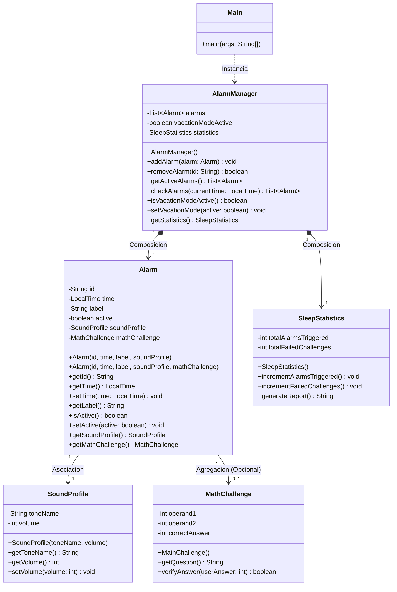
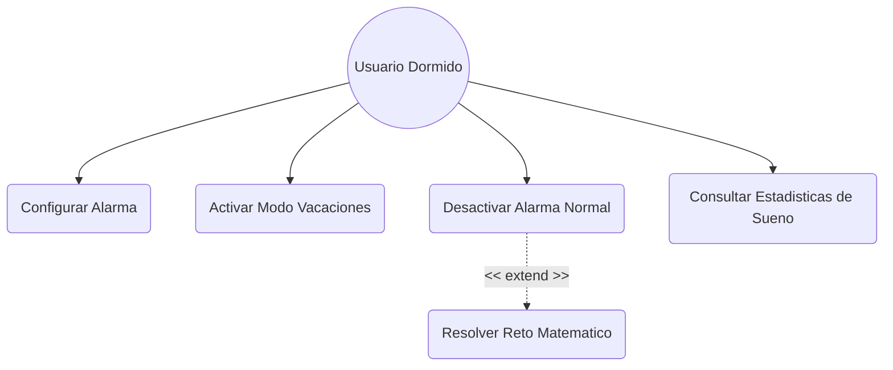

# ⏰ Smart Alarm Clock - Despertador Inteligente

## 📝 1. Descripción del Proyecto
Este sistema es un motor de lógica desarrollado en Java enfocado en la gestión avanzada y automatización de alarmas inteligentes. Diseñado bajo principios de ingeniería de software orientada a objetos, encapsulamiento estricto y desacoplamiento de responsabilidades, el sistema opera de forma óptima a través de consola, eliminando la necesidad de interfaces gráficas para centrar su valor en la robustez algorítmica y la calidad del diseño de software.

## 🎯 2. Objetivos del Sistema
* **Desactivación Consciente:** Evita el apagado reflejo o involuntario del usuario dormido mediante retos matemáticos dinámicos y autogenerados.
* **Automatización Flexible (Modo Vacaciones):** Permite silenciar temporalmente flujos de alarmas ordinarias completos con un único interruptor general sin alterar la configuración del usuario.
* **Monitorización Analítica (Estadísticas):** Computa estadísticas detalladas sobre el comportamiento del usuario y su calidad de sueño basadas en el registro de alarmas disparadas e intentos fallidos.

## 🛠️ 3. Tecnologías Utilizadas
* **Lenguaje de Programación:** Java SE (JDK 17).
* **Entorno de Desarrollo:** Visual Studio Code con Extension Pack para Java.
* **Control de Versiones:** Git & GitHub (Flujo GitFlow por ramas).
* **Modelado y Documentación:** Lenguaje UML estructurado mediante sintaxis nativa de Mermaid.

## 🚀 4. Instalación y Ejecución
1. Clone este repositorio en su directorio local o descargue el código fuente.
2. Abra la carpeta raíz del proyecto (`smart-alarm-clock`) en su IDE (Visual Studio Code).
3. Asegúrese de que el entorno reconozca el SDK de Java.
4. Diríjase al archivo ejecutable ubicado en `src/Main.java`.
5. Ejecute el programa utilizando el botón de ejecución (**Run Java** o el triángulo de **Play** $\triangleright$) de su IDE para comprobar la simulación cronológica completa por consola.

## 📁 5. Estructura del Proyecto
```text
smart-alarm-clock/
├── src/                    # Código fuente del sistema (.java)
│   ├── model/              # Paquete del modelo del dominio
│   │   ├── Alarm.java
│   │   ├── AlarmManager.java
│   │   ├── MathChallenge.java
│   │   ├── SoundProfile.java
│   │   └── SleepStatistics.java
│   └── Main.java           # Orquestador y simulador principal
├── docs/                   # Documentación técnica adicional y capturas
├── tests/                  # Carpeta destinada a pruebas unitarias
└── README.md               # Guía y memoria técnica del proyecto
```

---

## 🏗️ 6. Diseño Orientado a Objetos (Clases, Responsabilidades y Relaciones)

El sistema ha sido estructurado siguiendo el principio de alta cohesión y bajo acoplamiento, aislando las lógicas de negocio en componentes independientes:

* **`Alarm`:** Representa una entidad de alarma individual. Es responsable de almacenar su propio identificador, hora de disparo, etiqueta descriptiva y estado (activa/inactiva). Delegando lógicas complejas, se asocia a un perfil de sonido y opcionalmente contiene un reto matemático.
* **`SoundProfile`:** Encapsula las propiedades acústicas del despertador, como el nombre del tono y el volumen. Protege que el volumen permanezca en rangos válidos.
* **`MathChallenge`:** Encapsula de forma exclusiva la lógica de los retos matemáticos. Es responsable de autogenerar operandos aleatorios y de evaluar si la respuesta del usuario es correcta.
* **`SleepStatistics`:** Módulo métrico encargado de acumular los datos de uso del despertador (alarmas totales que han sonado e intentos incorrectos del usuario).
* **`AlarmManager`:** El "cerebro" o controlador del sistema. Gestiona la colección dinámica de alarmas (`ArrayList`), coordina su adición o eliminación y evalúa minuto a minuto cuál debe dispararse aplicando reglas globales como el Modo Vacaciones.

### Justificación Técnica de Arquitectura (SOLID y Encapsulación)
* **Encapsulación Estricta:** Todos los atributos de las clases del modelo son estrictamente privados (`private`). El acceso a los estados se realiza mediante métodos de acceso públicos (`getters` y `setters`), garantizando que ninguna clase externa corrompa los datos internos.
* **Principio de Responsabilidad Única (SRP):** En lugar de sobrecargar a la clase `Alarm` con lógicas de generación de números aleatorios o acumulación de contadores, cada tarea se delega a su propia clase especializada (`MathChallenge` y `SleepStatistics`), facilitando el mantenimiento del código.

---

## 📊 7. Diagrama de Clases UML (Mermaid)



**Justificación de Relaciones:** Se aplica **Composición** entre `AlarmManager` y sus elementos (`Alarm` y `SleepStatistics`) ya que su ciclo de vida depende del administrador. La relación de `Alarm` con `MathChallenge` se modela mediante **Agregación Opcional** ($0..1$), permitiendo la coexistencia de alarmas comunes y avanzadas.

---

## 👥 8. Diagrama de Casos de Uso UML (Mermaid)



---

## 📋 9. Especificación Completa de Casos de Uso

### Caso de Uso: CU-04 Resolver Reto Matemático para Desactivación

| Campo | Descripción |
| :--- | :--- |
| **Nombre** | CU-04 Resolver Reto Matemático para Desactivación |
| **Objetivo** | Forzar al usuario a resolver una operación aritmética aleatoria para garantizar que se encuentra despierto antes de silenciar una alarma crítica. |
| **Actor principal**| Usuario Dormido |
| **Precondiciones** | 1. El sistema tiene almacenada al menos una alarma configurada con un objeto `MathChallenge` asociado.<br>2. El reloj del sistema coincide exactamente con la hora programada de dicha alarma.<br>3. El Modo Vacaciones se encuentra desactivado. |
| **Flujo principal**| 1. El reloj del sistema alcanza la hora programada de una alarma crítica.<br>2. El `AlarmManager` dispara la alarma mostrando la advertencia de activación sonora.<br>3. El sistema detecta que la alarma posee un reto matemático y bloquea el botón de apagado estándar.<br>4. El sistema genera aleatoriamente dos operandos y muestra la pregunta en consola (Ej: ¿Cuánto es 7 + 4?).<br>5. El usuario introduce la respuesta numérica por consola.<br>6. El sistema valida internamente el resultado aritmético introducido.<br>7. El sistema silencia la alarma con éxito, registra el evento e incrementa el contador en `SleepStatistics`. |
| **Flujos alternativos** | **Flujo Alternativo A: Respuesta Incorrecta (Paso 5)**<br>1. El usuario introduce un resultado erróneo debido a la somnolencia.<br>2. El sistema deniega el apagado emitiendo una alerta en consola.<br>3. El sistema incrementa el contador de fallos en `SleepStatistics` de forma analítica.<br>4. La alarma continúa reproduciéndose activamente en bucle.<br>5. El flujo retorna al punto 4 del flujo principal para solicitar una nueva respuesta. |
| **Postcondiciones**| La alarma crítica se desactiva con éxito únicamente cuando el usuario introduce la solución aritmética correcta, quedando registrado su rendimiento en el módulo de estadísticas. |
| **Reglas de negocio**| 1. Los operandos generados de forma automática por la clase `MathChallenge` deben ser obligatoriamente enteros comprendidos en un rango del 1 al 10 para balancear dificultad y usabilidad.<br>2. No se permitirá ninguna opción de "postergación" o "snooze" de la alarma crítica hasta que el reto sea resuelto con éxito si este ha sido configurado como obligatorio. |